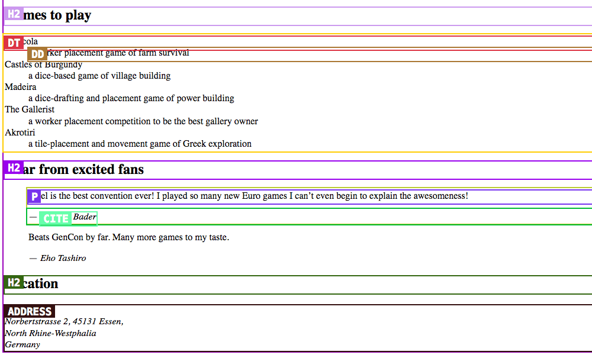

# Element highlighter

**A small script to write out & highlight HTML elements, modules or grids for better in-class solutions examples.**

The idea behind this project is to help other teachers understand what to explain as solutions to in-class exercises. One example would be when I get students to sketch the semantic HTML tags onto a piece of paper. I create the solution in HTML, but want to explain the tags on the projector to the whole class. *This will create a little diagram for other teachers showing what tags to explain and where they are instead of them having to scour the code.*

---

## Use

1. Include a new `<script>` tag at the bottom of the HTML page you want to highlight—and point it to the instance of `element-highlighter`:

```js
<script src="https://thomasjbradley.github.io/element-highlighter/index.js"></script>
```

2. Tell element-highlighter what to highlight by adding a `data-element-highlighter` attribute:

```js
<script data-element-highlighter="semantics grids modules" src="https://thomasjbradley.github.io/element-highlighter/index.js"></script>
```

The `data-element-highlighter` attribute can contain one, or many, of these values:

- `semantics`
- `semantics-divs`
- `grids`
- `modules`

That’s it! Run it in the browser and test it out. Here’s an example of the output:



### Label specific features

You can add a data attribute to elements and that element will be displayed in the box too.

```html
<div data-element-highlighter-label="inline-block">

</div>
```

*This example can be used to call out the fact that this element is styled with `display: inline-block`*

### Caveats

1. This wasn’t tested on really complex or large pages—usage may vary.
2. There may be a noticeable delay before the boxes show up—sometimes not all the `load` events are caught in time so there’s a few second delayed backup launcher.
3. The grid detection system is looking for the [Gridifier](http://gridifier.web-dev.tools/) classes.
4. The module detection system is looking for the [Modulifier](http://modulifier.web-dev.tools/) classes.
5. There will be overlapping labels. My use-case is to generate a screenshot of the output, so if I find overlapping labels I’ll slightly massage them in DevTools before taking the screenshot.

---

## License & copyright

© 2017 Thomas J Bradley · [Licensed under the MIT License](LICENSE)
